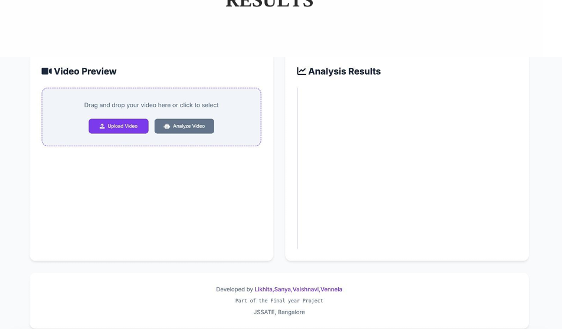
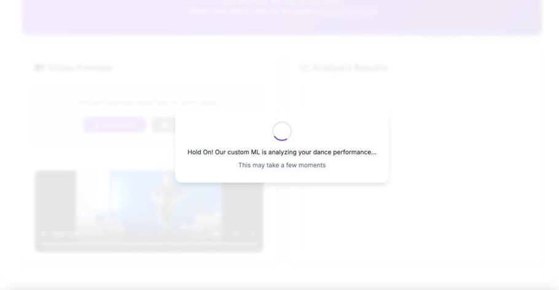
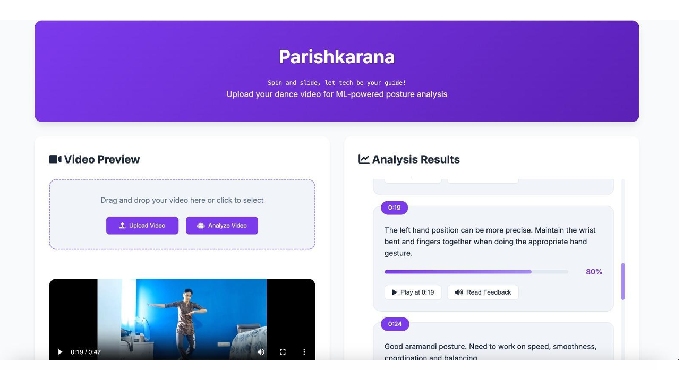
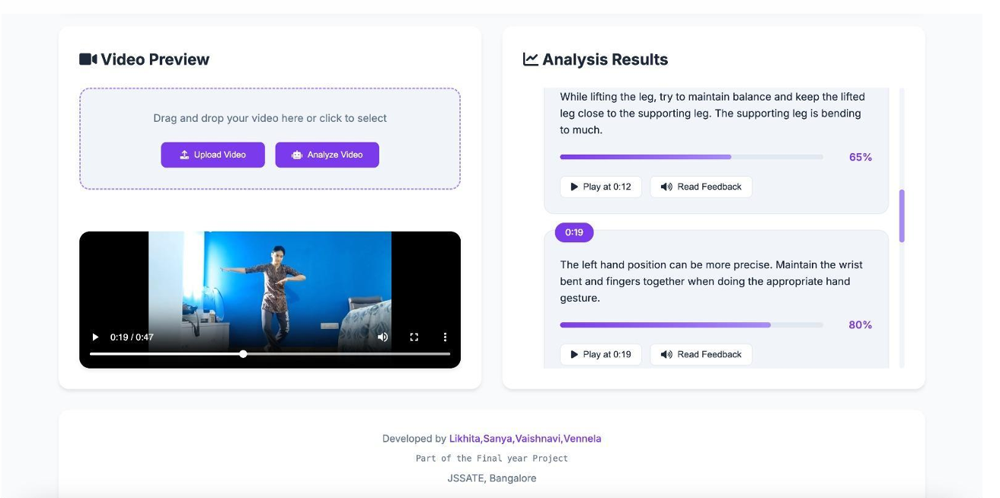

# AI-Powered Posture Correction for Classical Dance (Natta Adavu)

## 📌 Overview
This project presents an AI-powered system designed to analyze and correct posture in **classical Indian dance**, specifically *Natta Adavu* (Bharatanatyam). It combines **computer vision, deep learning, and audio analysis** to provide real-time feedback on dance performance.

The system acts as a bridge between **traditional dance teaching methods** and **modern AI technology**, enabling learners to practice effectively even without constant instructor supervision.

---

## 🚀 Features

- 🎯 **Pose Detection** using MediaPipe (33 keypoints)
- 🧠 **LSTM-based Deep Learning Model** for temporal movement analysis
- 🎵 **Audio Beat Synchronization** using Librosa
- 📊 **Movement Quality Scoring**
- ⏱ **Timestamped Feedback**
- 📈 **Performance Analysis & Progress Tracking**
- 🎥 Supports **reference vs student video comparison**

---

## 🧠 System Architecture

The system consists of the following layers:

1. **Input Layer**
   - Accepts student and reference videos
   - Performs preprocessing and validation

2. **Preprocessing Layer**
   - Extracts pose landmarks using MediaPipe
   - Performs audio beat detection

3. **LSTM Analysis Layer**
   - Analyzes temporal sequences of movements
   - Evaluates spatial + temporal accuracy

4. **Feedback Generation Layer**
   - Generates actionable insights
   - Evaluates posture, rhythm, and movement

5. **Output Layer**
   - Displays scores, errors, and timestamped feedback

---

## 🛠️ Tech Stack

### Core Technologies
- Python 3.11+
- OpenCV
- MediaPipe
- PyTorch
- Librosa

### Supporting Libraries
- NumPy, Pandas, SciPy
- Matplotlib
- Scikit-learn
- FFmpeg

### Backend
- Flask / FastAPI
- Uvicorn

### Frontend
- React (UI for feedback visualization)

---

## ⚙️ Installation

```bash
# Clone repository
git clone <your-repo-url>
cd project-folder

# Create virtual environment
python -m venv venv
source venv/bin/activate  # Linux/macOS
venv\Scripts\activate   # Windows

# Install dependencies
pip install -r requirements.txt
```

---

## ▶️ Usage

1. Upload a **dance video**
2. System extracts:
   - Pose landmarks
   - Audio rhythm
3. Model compares with reference data
4. Get:
   - Accuracy score
   - Mistake highlights
   - Timestamped corrections

---

## 📊 Results

- Real-time posture correction feedback
- Movement accuracy scoring
- Rhythm synchronization analysis
- Visual UI showing errors and suggestions

---

## 📸 Project Review (Screenshots)

### 🏠 Landing Page


---

### 🎥 Video Processing


---

### 📊 Feedback Output


---

### 📈 Detailed Feedback



---

## 🧩 Challenges Solved

- Lack of personalized feedback in dance learning
- Difficulty in maintaining posture accuracy
- Absence of temporal (sequence-based) evaluation in existing systems

---

## 🔮 Future Improvements

- 3D pose estimation
- Multi-camera support
- Mobile app integration
- Voice-guided corrections
- Gamification features
- Support for other dance forms

---


